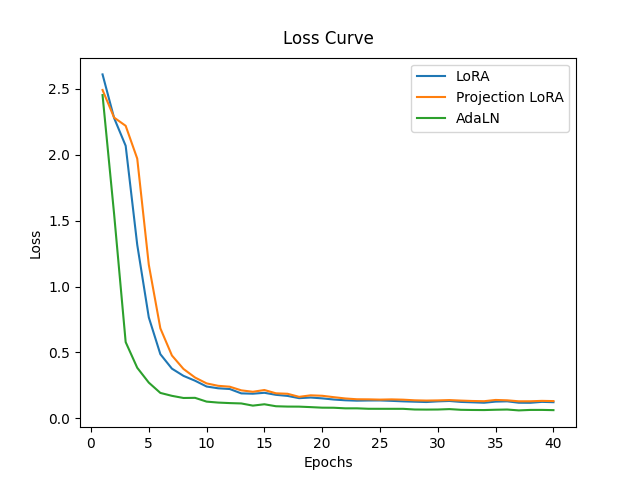
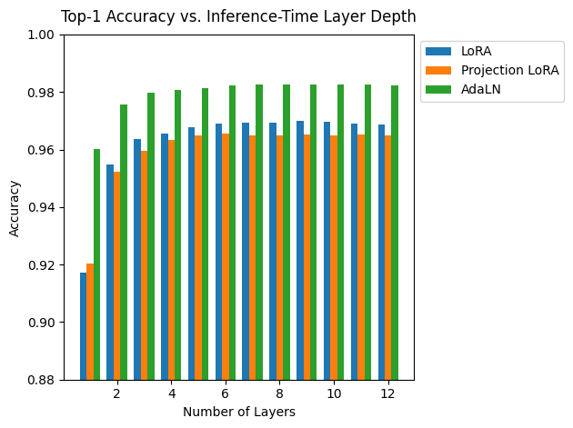

# Recursive Transformer

A Vision Transformer (ViT) implementation that utilizes recursive block application with Adaptive Layer Normalization (AdaLN) and Low-Rank Adaptation (LoRA) for timestep-conditioned classification.

## Table of Contents

1. [Project Overview](#project-overview)
2. [Project Structure](#project-structure)
3. [Tech Stack](#tech-stack)
4. [Application Info](#application-info)
5. [Getting Started](#getting-started)
6. [Project Files](#project-files)
7. [Results](#results)

## Project Overview

This project explores a **Recursive Vision Transformer** architecture where a single transformer block is applied iteratively for a variable number of steps. To make the model aware of the current iteration step, we employ two distinct conditioning mechanisms:

- **AdaLN (Adaptive Layer Normalization):** Dynamically scales and shifts layer normalization parameters based on the current timestep.
- **LoRA (Low-Rank Adaptation):** Modifies the weights of linear layers using low-rank updates that can either be fixed per step or projected from a continuous time embedding.

The model is primarily tested on the MNIST dataset to evaluate its ability to refine its internal representations over multiple recursive steps.

## Project Structure

```text
RecursiveTransformer/
├── configs/            # YAML configuration files for models and training
├── model/              # Core model implementation
│   ├── components/     # Building blocks (AdaLN, LoRA, Embeddings)
│   ├── vit/            # Vision Transformer blocks and model variants
│   ├── model.py        # High-level Classifier wrappers
│   └── recursive_vit.py # Training and Inference orchestration
├── results/            # Training logs and visualization plots
├── scripts/            # Entry points for training and inference
├── utils/              # Dataset loading and miscellaneous helpers
├── environment.yml     # Conda environment specification
└── requirements.txt    # Pip dependencies
```

## Tech Stack

- **Framework:** PyTorch
- **Architecture:** Vision Transformer (ViT)
- **Techniques:** LoRA, AdaLN, Recursive Neural Networks
- **Utilities:** Transformers (HuggingFace), NumPy, Matplotlib, YAML, tqdm

## Application Info

The project provides two main scripts in the `scripts/` directory:

- `train.py`: Used to train the recursive model using either the `lora` or `adaln` version.
- `infer.py`: Performs inference and evaluation on a trained checkpoint across different recursive steps.

Configurations are managed via YAML files in the `configs/` directory, allowing for easy experimentation with hyperparameters like embedding dimensions, number of heads, and LoRA rank.

## Getting Started

### Prerequisites

- Python 3.10+
- CUDA-enabled GPU (optional but recommended)

### Clone the Repo

```bash
git clone https://github.com/kaitosuzuki-CS/practice.git
cd Practice/RecursiveTransformer
```

### Setting Up

#### With Conda

```bash
conda env create -f environment.yml
conda activate recursive-transformer
```

#### With Pip

```bash
conda create -n recursive-transformer python=3.14
conda activate recursive-transformer
pip install -r requirements.txt
```

### Running Training

```bash
python -m scripts.train --version lora --model-config-path configs/lora_model_config.yml --train-config-path configs/lora_train_config.yml
```

## Project Files

### `model/` Directory

The heart of the implementation:

- **`recursive_vit.py`**: Contains the `RecursiveViT` class which manages the training loop, including timestep sampling and optimizer scheduling.
- **`model.py`**: Defines `LoRAClassifier` and `AdaLNClassifier`, which wrap the core ViT with a classification head.
- **`vit/vit.py`**: Implements `LoRAViT` and `AdaLNViT`, defining how input patches are processed through the recursive blocks.
- **`components/`**:
  - `lora.py`: Implementation of `LoRALinear` and `LoRAAttentionLayer` for parameter-efficient conditioning.
  - `adaln.py`: Implementation of `AdaLN` for modulating features via time embeddings.
  - `embeddings.py`: Standard patch and position embeddings for ViT.

### `scripts/` Directory

Execution entry points:

- **`train.py`**: The main training script. Supports training the recursive ViT with either LoRA or AdaLN conditioning by selecting the `--version` flag.
- **`infer.py`**: The inference and evaluation script. Loads a trained checkpoint and evaluates the model's performance across different recursive steps (timesteps).

## Results

### Training Performance

The model exhibits stable convergence during training on MNIST. Below is the loss curve showing the reduction in cross-entropy loss over epochs:



### Accuracy on MNIST

The recursive refinement allows the model to achieve high accuracy. The following plot illustrates the accuracy achieved across different recursive steps:


