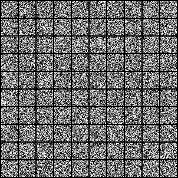
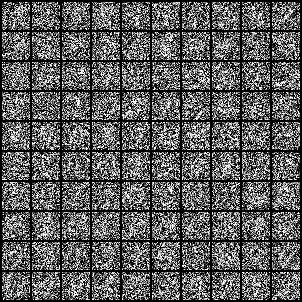
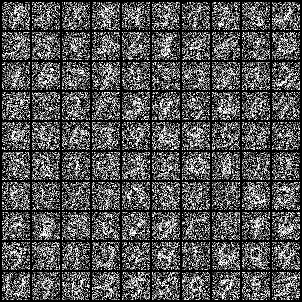
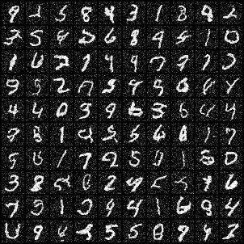

# Denoising Process for MNIST

This document shows the denoising process of the diffusion model at different timesteps for the MNIST dataset. The model starts with random noise at the highest timestep and gradually denoises it to generate a clean image at timestep 0.

| Timestep |                   Denoised Image                   |
| :------: | :------------------------------------------------: |
| **999**  |  |
| **900**  |  |
| **800**  |  |
| **700**  |  |
| **600**  |  |
| **500**  |  |
| **400**  |  |
| **300**  |  |
| **200**  |  |
| **100**  |  |
|  **0**   |      |
