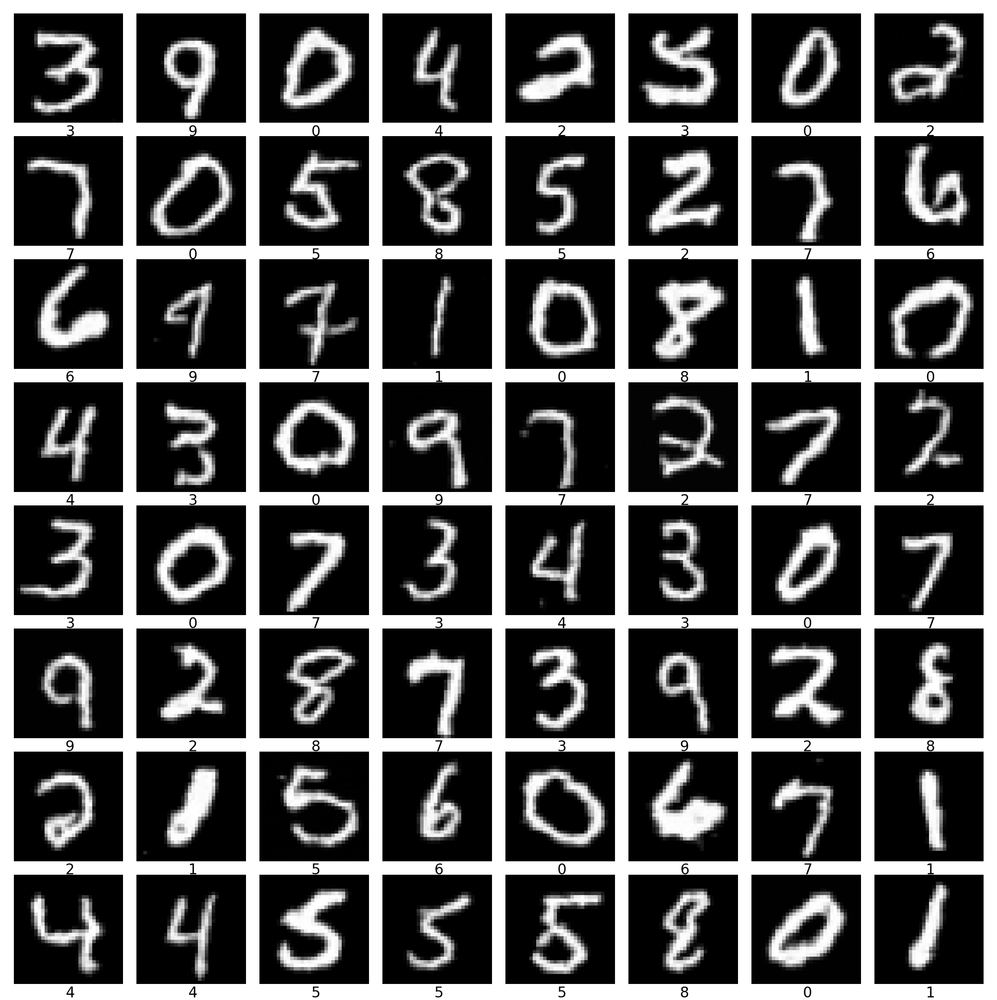

# Flow Matching with Classifier-Free Guidance

This project implements **Flow Matching** (Conditional Normalizing Flow) using **Linear Probabilistic Paths** and **Classifier-Free Guidance (CFG)**. The model architecture features a U-Net-style structure with **Adaptive Layer Normalization (AdaLN)** for time and class conditioning.

## Table of Contents

- [Project Overview](#project-overview)
- [Project Structure](#project-structure)
- [Tech Stack](#tech-stack)
- [Getting Started](#getting-started)
- [Results](#results)
- [Project Files](#project-files)

## Project Overview

This project explores the implementation of Flow Matching, a generative modeling technique that learns a vector field to map a simple distribution (Gaussian noise) to a complex data distribution (images).

### Flow Matching (Linear Probabilistic Paths)

The model learns a vector field $v_\theta(x_t, t)$ that generates a probability path between noise $x_0 \sim p_0$ and data $x_1 \sim p_1$. Using **Linear Probabilistic Paths**, the intermediate samples $x_t$ are defined by linear interpolation:

$$
x_t = (1 - t)x_0 + t x_1
$$

The corresponding target velocity is:

$$
u_t(x_1 | x_0) = \frac{dx_t}{dt} = x_1 - x_0
$$

The model is trained to minimize the flow matching objective:

$$
\mathcal{L}_{FM} = \mathbb{E}_{t, q(x_t|x_1)} [\| v_\theta(x_t, t) - (x_1 - x_0) \|^2]
$$

### Classifier-Free Guidance (CFG)

To enhance class-conditional generation, we employ Classifier-Free Guidance. During training, the class label $y$ is randomly dropped (replaced with a null token $\emptyset$) with a certain probability. During inference, the velocity field is extrapolated using a guidance scale $\beta$:

$$
\hat{v}_\theta(x_t, t, y) = (1 + \beta) v_\theta(x_t, t, y) - \beta v_\theta(x_t, t, \emptyset)
$$

This allows for a trade-off between sample diversity and class consistency.

Key features include:

- **Flow Matching**: Implementation using linear interpolation paths.
- **Classifier-Free Guidance (CFG)**: Enhances sample quality via joint conditional/unconditional training.
- **AdaLN Conditioning**: Uses Adaptive Layer Normalization to inject time embeddings and class information.
- **U-Net Architecture**: An encoder-bottleneck-decoder structure with skip connections.

## Project Structure

```
flow_matching_cfg/
├── checkpoints/          # Saved model weights
├── configs/              # YAML configuration files for models and training
├── models/               # Neural network architectures
│   ├── flow_model/       # Core model implementation
│   │   ├── blocks/       # Encoder, Decoder, and Bottleneck modules
│   │   ├── components/   # AdaLN and other building blocks
│   │   └── flow_model.py # Main FlowModel (U-Net) class
│   └── flow_matching_cfg.py # Training wrapper and CFG logic
├── samples/              # Generated sample images
├── scripts/              # Entry point scripts
│   ├── infer.py          # Inference script for generating samples
│   └── train.py          # Main training entry point
├── utils/                # Utility scripts
│   ├── dataset.py        # Dataloader setup
│   ├── early_stopping.py # Early stopping implementation
│   └── misc.py           # Miscellaneous helpers
├── environment.yml       # Conda environment configuration
└── requirements.txt      # Pip dependencies
```

## Tech Stack

- **Framework**: [PyTorch](https://pytorch.org/)
- **Optimization**: [HuggingFace Transformers](https://github.com/huggingface/transformers) (Cosine Learning Rate Scheduler)
- **Configuration**: YAML
- **Utilities**: NumPy, tqdm, Matplotlib (for visualization)

## Getting Started

### 1. Clone the Repository

```bash
git clone --filter=blob:none --sparse https://github.com/kaitosuzuki-CS/practice.git
cd practice
git sparse-checkout set flow_matching_cfg
cd flow_matching_cfg
```

### 2. Environment Setup

Set up the environment using `conda` or `pip`.

**Using Conda:**

```bash
conda env create -f environment.yml
conda activate fm-cfg
```

**Using Pip:**

```bash
pip install -r requirements.txt
```

### 3. Training

To train the model on the default dataset (e.g., MNIST) as configured in `configs/`:

```bash
python -m scripts.train --model-config-path configs/model_config.yml --train-config-path configs/train_config.yml
```

### 4. Inference

To generate samples using a trained checkpoint:

```bash
python -m scripts.infer --ckpt-path checkpoints/best_model.pt --num-samples 64 --num-timesteps 100 --save-path samples/samples.png
```

## Results

The following image demonstrates samples generated by the model after training. The Classifier-Free Guidance helps in producing clear and distinct class-conditioned outputs.



## Project Files

- **`scripts/infer.py`**: Loads a checkpoint and generates a grid of images using ODE integration (Euler method) with Classifier-Free Guidance.
- **`scripts/train.py`**: Entry point for training. Parses arguments and initializes the training process via the `FlowMatchingCFG` wrapper.
- **`models/flow_matching_cfg.py`**: High-level wrapper that implements the training loop (Vector Field Regression) and the inference logic.
- **`configs/`**: Directory containing YAML configuration files for model and training.
  - **`configs/model_config.yml`**: Architectural hyperparameters (embedding dims, channels, classes).
  - **`configs/train_config.yml`**: Training hyperparameters (learning rate, batch size, CFG dropout).
- **`models/`**: Directory containing the neural network architecture.
  - **`models/flow_model/flow_model.py`**: Defines the `FlowModel` class, a U-Net styled architecture for vector field estimation.
  - **`models/flow_model/components/adaln.py`**: Implementation of Adaptive Layer Normalization for time/class conditioning.
  - **`models/flow_model/blocks/`**: Contains `encoder.py`, `decoder.py`, and `bottleneck.py` modules.
- **`utils/`**: Directory for utility scripts.
  - **`utils/dataset.py`**: Dataloader setup and preprocessing.
  - **`utils/early_stopping.py`**: Early stopping logic to monitor validation loss.
  - **`utils/misc.py`**: Miscellaneous helpers for reproducibility and image saving.
- **`checkpoints/`**: Directory for saved model weights (`.pt` files).
- **`samples/`**: Directory for generated sample images.
